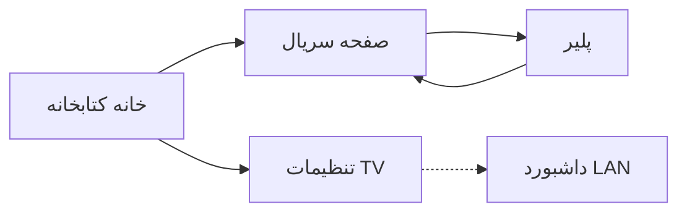
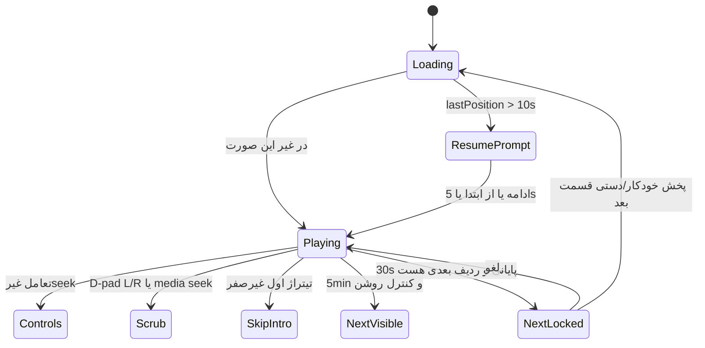

# طراحی محصول، تجربه و فنی iTV

سند طراحی نسخهٔ بعدی اپ Android TV. جزئیات قسمت محصول فیلد `stream.telewebion` را با نشانی HLS برمی‌گرداند؛ این پاسخ API و خود پلی‌لیست تأیید شده‌اند. پخش همان استریم داخل اپ روی تلویزیون هنوز آزمایش نشده و نباید اثبات‌شده روی دستگاه فرض شود. API منبع ممکن است خصوصی یا ناپایدار باشد و دسترسی HLS ممکن است منقضی شود؛ بنابراین نشانی استریم را از `content_id` نسازید و هنگام پخش جزئیات و URL را تازه کنید.

## ۱. هدف و محدوده

iTV کتابخانهٔ محلی سریال‌های تلوبیون است، نه یک سریال هاردکد. ادمین از مرورگر روی همان LAN با `IP:port` تلویزیون (الگوی SibiTV) نشانی `/program/<id>` یا `/product/<id>` وارد می‌کند. سرور HTTP فقط تا وقتی اپ باز است لازم است؛ شامل صفحهٔ پخش. با خروج یا رفتن به پس‌زمینه می‌تواند بایستد.

نوع منبع از مسیر URL تعیین می‌شود (`/product/` در برابر `/program/`)، نه از تعداد فصل. هر دو نوع می‌توانند یک یا چند فصل داشته باشند. خانه از تازه‌ترین افزوده‌شده به iTV به قدیمی‌ترین. صفحهٔ اختصاصی سریال، مرور قسمت، وضعیت دیده‌شده و موقعیت ادامه. ماندگاری Room. اگر تلوبیون نشانگر تیتراژ بدهد، «رد کردن تیتراژ» در زمان درست. در ۳۰ ثانیهٔ پایانی کارت قسمت بعد با شمارش و لغو به‌سبک SibiTV. رفتار کنترل پخش باید با SibiTV واقعی یکی باشد، بدون زیرنویس. برند iTV، فونت IR Terafik (نه B Traffic)، UI فارسی RTL و ارقام فارسی.

خارج از محدوده: دانلود فایل، زیرنویس، سرویس دائمی پس‌زمینه، ساختن URL استریم محصول از `content_id`، و ادعای اثبات پخش روی تلویزیون.

## ۲. مهاجرت از پروتوتایپ فعلی

پروتوتایپ در `app.itv.prototype` یک برنامهٔ هاردکد است (`PROGRAM = 0x296b3ea`، «دختران»). `Api.episodes` از `getEpisodesByProgramID` با `First=100` می‌خواند، شماره را از عنوان پارس می‌کند، `number > 0` را فیلتر و بر اساس شماره مرتب می‌کند. README صریحاً می‌گوید قسمت‌های غایب ساختگی نشان داده نمی‌شوند؛ ولی فیلتر/مرتب‌سازی روی شماره برای نمونهٔ `0x1b29939` (تکرار ۲۶/۳۱ و نبود ۳۲) غلط است و باید کنار برود.

قابل حفظ: Media3/ExoPlayer، الگوی HLS برنامه (`cdna` + `channel.descriptor` + `EpisodeID`)، فونت `irterafik_family`، رنگ‌های `#05080C` / `#2EE6F0` / `#F3FBFC`، RTL، `persianDigits`، تصویر قسمت `https://static.telewebion.net/episodeImages/<id>/default`، بنر Leanback، `minSdk 23`.

قابل دورریختن: Activity XML تک‌سریاله، کش `LruCache` تصویر، کنترلر پیش‌فرض Media3، seek متقارن ۱۰ ثانیه، نبود Room/داشبورد/ادامه/قسمت بعد. پلیر بعدی Compose اختصاصی شبیه SibiTV با برند و فونت iTV.

## ۳. ناوبری و چیدمان تقریبی



**خانه (RTL):**

```
[● iTV    ANDROID TV]                              [تنظیمات]
[ پوستر ] [ پوستر ] [ پوستر ]     جدید → قدیم بر اساس addedAt
  عنوان     عنوان     عنوان
  برنامه    محصول     در حال ورود…
```

کارت: پوستر، عنوان محلی یا منبع، نوع، تعداد فصل/قسمت `sourcePresent`، نوار ادامه اگر `lastPosition` یا قسمت دیده‌نشده باشد. فوکوس اولیه اولین کارت. خانهٔ خالی: متن راهنما برای باز کردن تنظیمات و داشبورد.

**صفحهٔ سریال:** هیرو راست/چپ (پوستر + عنوان + خلاصه در صورت وجود) و اکشن «ادامه» یا «پخش اولین دیده‌نشده». چندفصل: ردیف فصل، سپس قسمت‌های همان فصل به ترتیب نمایش (شمارهٔ فصل، بعد شمارهٔ نمایشی صعودی). تک‌فصل همان صفحه است؛ فصل جعلی ساخته نمی‌شود. کارت قسمت: تصویر، برچسب نمایشی منبع حتی اگر تکراری («قسمت ۲۶» دوبار)، عنوان، دیده/ادامه. قسمت `sourcePresent = false` در مرور عادی مخفی است. ردیف‌های واقعی با شمارهٔ تکراری یا جاافتاده حفظ می‌شوند و شمارهٔ خیالی ساخته نمی‌شود.

**تنظیمات TV:** نشانی کامل داشبورد، QR همان URL، PIN جاری، وضعیت سرور، پورت واقعی نشست، و یک جمله که سرور با بستن اپ قطع می‌شود.

**پلیر:** تمام‌صفحه؛ overlay کنترل پایین؛ دیالوگ ادامه مرکز؛ کارت قسمت بعد راست (فیزیکی، مثل SibiTV)؛ دکمهٔ رد تیتراژ نزدیک مرکز پایین وقتی پنجرهٔ تیتراژ فعال است. بدون پنل زیرنویس.

## ۴. توکن، فونت، فوکوس، رقم، RTL

- فونت سراسری IR Terafik ۴۰۰/۷۰۰؛ B Traffic ممنوع.
- پس‌زمینه `#05080C`، سطح `#0D151C`، تأکید `#2EE6F0`، متن `#F3FBFC`، کم‌رنگ `#8AA3AB`، خطا `#FF8A80`، درخشش فوکوس `#6632F0FF`.
- فوکوس: مقیاس حدود ۱٫۰۶–۱٫۰۸، elevation، متن تیره روی سطح روشن مثل پروتوتایپ.
- کتابخانه و تنظیمات `RTL`. لایهٔ کنترل پلیر می‌تواند `LTR` بماند (عادت ریموت SibiTV برای چپ/راست)؛ برچسب‌ها فارسی.
- ارقام نمایشی تلویزیون فارسی: شماره، شمارش، مدت، پرش زمانی. ذخیره‌سازی و API غربی. ارقام فارسی/عربی URL قبل از پارس به ASCII.
- داشبورد وب هم فارسی و RTL؛ ارقام می‌توانند فارسی باشند.

## ۵. جریان داشبورد و ادمین

سرور Ktor روی تلویزیون HTML/API را از همان مبدأ سرو می‌کند. مرورگر LAN همان را باز می‌کند.

جریان افزودن: ورود URL → allowlist → پیش‌نمایش (عنوان، پوستر، نوع، فصل‌ها/تعداد در صورت موجود) → تأیید → وارد کردن صفحه‌بندی‌شده با وضعیت زنده → خانه پس از commit اولین دستهٔ معتبر به‌روز شود. ویرایش فقط نام نمایشی محلی. حذف سریال پاک‌سازی سخت Room است. نوسازی همگام‌سازی مجدد منبع است.

پیشنهاد مسیرها (همه به‌جز خواندن وضعیت نیاز به توکن pairing دارند):

- `GET /` داشبورد
- `POST /api/preview` بدنه `{ url }`
- `POST /api/series` افزودن
- `GET /api/series` فهرست + `importState`
- `PATCH /api/series/{id}` عنوان محلی
- `DELETE /api/series/{id}`
- `POST /api/series/{id}/refresh`
- `POST /api/pair` با PIN

خطا روی داشبورد و کارت خانه: URL نامعتبر، تکراری، شبکه، پاسخ خالی، صفحه‌بندی ناقص.

Allowlist ورودی: فقط `https://telewebion.net/program/<id>` و `https://telewebion.net/product/<id>` با `id` شبیه `0x` + هگز. `/archive` و query دور ریخته می‌شود. host دیگر، IP خام، `file:`، و URL دلخواه ممنوع. سرور هرگز به نشانیِ کلاینت fetch نمی‌کند؛ فقط endpointهای ثابت دروازه.

## ۶. آداپتور API و نگاشت

پایه: `https://gateway.telewebion.net`. User-Agent اختصاصی iTV. بعد از ۱۰۰ ردیف Offset اجباری است تا آرایه خالی شود.

**برنامه (تأییدشده):**  
`GET /kandoo/program/getEpisodesByProgramID/?ProgramID=<id>&First=100&Offset=0` → `body.queryProgram[0]` + `episodes`. هویت: `EpisodeID`. ترتیب = ترتیب آرایه‌ها پس از پیمایش، نه شماره. جزئیات: `GET /kandoo/episode/getEpisodeDetail/?EpisodeId=<id>`. پخش تأییدشده: `https://cdna.telewebion.net/<channel>/episode/<episodeId>/playlist.m3u8`. نمونه‌ها: `0x296b3ea` دختران؛ `0x1b29939` روشن‌تر از خاموشی با ۳۶ ردیف، شماره‌های ۱–۳۵، تکرار ۲۶ و ۳۱، نبود ۳۲. `exclude_periods` قطعهٔ پخش زنده است نه تیتراژ؛ برای Skip Credits استفاده نشود.

**محصول (کاتالوگ و نشانی HLS در جزئیات تأییدشده؛ پخش داخل اپ روی دستگاه هنوز آزمون نشده):**  
`GET /kandoo/vod/content/get-content?content_id=<id>&q=abc` → `body.content[0].sorted_seasons`. هر فصل: `GET /kandoo/vod/content/get-serial?content_id=<id>&season=<N>&first=100&offset=0` → `serial_parts`. هویت قسمت: `content_id` همان جزء. جزئیات همان `get-content`. تیتراژ: `first_titraje_start`، `first_titraje_end`، `last_titraje_start` (ثانیه). صفر = ناموجود.

جزئیات قسمت محصول مستقیماً نشانی HLS را در `body.content[0].stream.telewebion` دارد. همان فیلد برگشتی را به کار ببرید. شناسهٔ `episode` داخل مسیر استریم با `content_id` محصول فرق دارد؛ ساختن `playlist.m3u8` از `content_id` ممنوع است. هنگام پخش، جزئیات همان قسمت و URL استریم را دوباره بخوانید چون دسترسی ممکن است تغییر کند. اگر `stream.telewebion` خالی یا نامعتبر بود، خطای استریم نشان دهید، نه پیام «تأیید نشده».

نمونه‌های تأییدشدهٔ API و پلی‌لیست (GET استریم = HTTP ۲۰۰، `Content-Type: application/vnd.apple.mpegurl`، بدنه با `#EXTM3U`): محصول `0xc20bf81` زیرخاکی فصل‌های ۱–۴ با ۱۹/۱۶/۱۴/۱۶ قسمت؛ جزء اول فصل ۱ `0xc212146` → `stream.telewebion` = `https://cdna.telewebion.net/ifilm/episode/0xff56cd3/playlist.m3u8`. محصول `0xc83b6d3` دیوار دفاعی فصل ۱ با ۸ قسمت؛ جزئیات `0xc83b6d7` → `stream.telewebion` = `https://cdna.telewebion.net/tv3/episode/0x16ccb7b8/playlist.m3u8`. این شواهد پاسخ دروازه و فایل پلی‌لیست را ثابت می‌کنند، نه پخش موفق داخل اپ روی تلویزیون.

مدل داخلی مشترک: `sourceKind`، `sourceId`، `sourceEpisodeId`، `sourceOrder` سراسری از صفر (ترتیب پیمایش منبع، برای هویت و تساوی)، `seasonNumber` منبع، `displayNumber` قابل تکرار/خالی، تیتراژ اختیاری. ترتیب نمایش و ناوبری پخش از `sourceOrder` خام پیروی نمی‌کند: هر فصل از شمارهٔ نمایشی ۱ تا آخر دیده می‌شود. تابع ترتیب نمایش: `seasonNumber`، سپس عدد `displayNumber` صعودی، سپس `sourceOrder` پایدار برای تکرار یا تساوی، و ردیف بدون شمارهٔ قابل‌پارس بعد از شماره‌دارهای همان فصل. هویت و پیشرفت فقط با `sourceEpisodeId`. قسمت بعد = ردیف بعدی همین ترتیب نمایش؛ حتی اگر فصل عوض شود، شماره تکرار شود، یا n+1 در منبع نباشد. منطق SibiTV (`episodeNumber + 1` یا فصل بعد قسمت ۱) کپی نشود و شمارهٔ غایب ساخته نشود.

## ۷. Room، هویت، ترتیب، نوسازی

```
series  1──* season 1──* episode
  └── sourceKind+sourceId یکتا
        └── seriesId+sourceEpisodeId یکتا
```

- `series`: `id`، `sourceKind`، `sourceId`، عنوان منبع، عنوان محلی، پوستر، `addedAt`، `refreshedAt`، `importState` (`queued|running|error|done`)، `importError`.
- `season`: `id`، `seriesId`، `seasonNumber`، `sourceOrder`، عنوان اختیاری.
- `episode`: `sourceEpisodeId`، `seriesId`، `seasonId`، `sourceOrder`، `displayNumber`، عنوان، تصویر، تیتراژها، `sourcePresent`، `lastPositionMs`، `isWatched`، `durationMs`.

ایندکس پیشنهادی: `(seriesId, sourceOrder)`، `(seriesId, seasonId, sourceOrder)`. unique روی شمارهٔ قسمت ممنوع. ردیف جاافتاده با شمارهٔ خیالی پر نشود.

نوسازی: upsert با `(seriesId, sourceEpisodeId)`؛ بازنویسی `sourceOrder` از پیمایش تازه؛ غایب در پاسخ → `sourcePresent = false`، مخفی، پیشرفت باقی. افزودن تکراری `sourceKind+sourceId` یک رکورد تازه نمی‌سازد و زمان `addedAt` را تغییر نمی‌دهد. حذف ادمین سخت. پیشرفت با ID قسمت منتقل می‌شود، نه با شماره.

## ۸. پلیر: رویداد، حالت، تقدم زمانی

مرجع خوانده‌شده: `SibiTV/.../PlayerActivity.kt`، `ui/components/PlayerControls.kt`، `ResumePlayDialog.kt`. Media3 ExoPlayer. iTV زیرنویس ندارد.

نقل رفتار SibiTV:

- ذخیره: `PROGRESS_SAVE_INTERVAL_MS = 3 * 60 * 1000L` به‌علاوه `onPause` و `onDestroy`.
- ادامه اگر `lastPosition > 10000`؛ پخش موقتاً `playWhenReady = false`.
- دیده‌شده: `threshold = minOf(300_000L, (duration * 0.1).toLong())` و `duration > 30_000 && currentPos >= duration - threshold`.
- نزدیک پایان: `savePos = 0` اگر `currentPos >= duration - 10000`.
- D-pad چپ/راست: گام `10000`؛ نگه‌داشتن `> 2000ms` → `60000`؛ debounce seek حدود `500ms`.
- `MEDIA_FAST_FORWARD` = `+30000`؛ `MEDIA_REWIND` = `-10000` (نامتقارن).
- کلید مرکز/پخش، نمایش کنترل و پخش/توقف را مطابق `PlayerActivity` و `PlayerControls` مرجع مدیریت می‌کند؛ اولویت رویداد وقتی کنترل یا پنل فرعی باز است در پیاده‌سازی و آزمون روی ریموت واقعی تثبیت شود.
- Back: اول پنل فرعی، بعد مخفی کنترل (`isControlsVisible = false`)، بعد `finish`.
- مخفی خودکار: `delay(8000)` هنگام پخش اگر پنل سرعت/پرش باز نباشد.
- کارت بعد: `isNearEnd = distanceToEnd < 5 * 60 * 1000` فقط با کنترل مرئی؛ `isCountdownActive = distanceToEnd < 30 * 1000` همیشه؛ شمارش از ۱۰؛ `Cancel` → `isCountdownCancelled`؛ قسمت آخر `nextEpisode == null`.
- دیالوگ ادامه: شمارش از ۵؛ در صفر `onResume()`.

iTV همان UX را نگه می‌دارد ولی ذخیره را حدود هر ۱۵–۲۰ ثانیه به‌علاوه pause / پس‌زمینه / `onStop` / `onDestroy` / انتقال قسمت انجام می‌دهد. سریال وقتی همهٔ قسمت‌های `sourcePresent` دیده‌شده‌اند دیده‌شده است.



رد تیتراژ فقط با نشانگر غیرصفر. شروع: از `first_titraje_start` تا `first_titraje_end` → seek به پایان تیتراژ اول. پایان: از `last_titraje_start` اگر > ۰ → seek به انتهای قسمت. `last_titraje_end` در یافته‌ها ثابت نشده. `exclude_periods` هرگز.

تقدم: دیالوگ ادامه همه را می‌بندد. در ۳۰ ثانیهٔ آخر کارت بعد فوکوس را قفل می‌کند؛ رد تیتراژ اگر همپوشان باشد ثانویه است. در ۵ دقیقهٔ آخر کارت بعد فقط با کنترل. تیتراژ آغازین مستقل است. شروع مجدد در کنترل: `seekTo(0)`. سرعت: `0.25 … 2.0`. پرش به زمان مثل دیالوگ SibiTV با برچسب فارسی.

## ۹. چرخهٔ عمر و امنیت سرور LAN

SibiTV از `MainActivity` سرویس پیش‌زمینه روی `8191` با CORS `anyHost()` می‌سازد. iTV آن را کپی نمی‌کند.

روشن با `ProcessLifecycle` ON_START (شامل پلیر)؛ خاموش با ON_STOP. سرویس پایدار بعد از خروج ممنوع. پورت پیشنهادی ۸۱۹۶ اگر آزاد باشد؛ وگرنه یک پورت آزاد همان نشست. تنظیمات و QR باید پورت واقعی را نشان دهند، نه عدد ثابت.

HTTP فقط LAN. مقدار فعلی `usesCleartextTraffic=false` برای درخواست‌های خروجی اپ است و به‌تنهایی مانع پاسخ‌دادن سرور Ktor به مرورگر LAN نمی‌شود؛ اتصال ورودی روی تلویزیون واقعی آزمایش شود. برای API خروجی تلوبیون HTTPS حفظ شود و مجوز cleartext سراسری اضافه نشود. CORS فقط همان مبدأ داشبورد، بدون wildcard. mutation بدون pairing ممنوع: PIN چهار رقمی روی TV + توکن کوتاه‌عمر. bind روی رابط LAN. بدون proxy باز، مسیر فایل دلخواه، یا SSRF. محدودیت نرخ وارد کردن. اگر اپ به پس‌زمینه برود وسط import، وضعیت `error` یا `queued` بماند و فقط با برگشت به پیش‌زمینه ادامه یابد.

## ۱۰. غیرعملکردی، خطا، آفلاین

کتابخانهٔ Room بدون شبکه خواندنی است. وارد کردن و پخش نیاز به شبکه دارند. پوستر کش دیسک/حافظه. نگه داشتن صفحه در پلیر (`FLAG_KEEP_SCREEN_ON`). خطاهای قابل نمایش: شبکه، ۴xx/۵xx منبع، فهرست خالی، استریم منقضی، محصول بدون `stream.telewebion` معتبر. پلیر: overlay بارگذاری/خطا با فوکوس روی «تلاش دوباره». وارد کردن نیمه‌کاره در فرایند کشته‌شده resume نمی‌شود تا اپ دوباره باز شود. Retry منبع محدود و idempotent؛ پیشرفت محلی حفظ شود.

## ۱۱. فازها و معیار پذیرش

۱. کتابخانه و Room: خانه و صفحهٔ سریال از دادهٔ محلی؛ `addedAt` نزولی؛ `sourceOrder` پایدار برای هویت/تساوی؛ نمایش هر فصل از ۱ تا آخر. نمونهٔ `0x1b29939` بدون قسمت خیالی ۳۲ و با دو ردیف ۲۶/۳۱؛ قسمت بعد و ادامه همان ترتیب مرئی را دنبال می‌کنند.

۲. وارد کردن برنامه: پیش‌نمایش/افزودن/وضعیت/ویرایش نام/حذف/نوسازی برای `/program/`؛ صفحه‌بندی بیش از ۱۰۰؛ هویت `EpisodeID`.

۳. سرور LAN: فقط هنگام باز بودن اپ؛ URL+QR+PIN؛ allowlist؛ بدون CORS باز؛ قطع پس از خروج.

۴. پلیر برنامه: HLS تأییدشده؛ کنترل، ادامه، کارت بعد، seek و سرعت مطابق SibiTV؛ ذخیرهٔ محکم‌تر؛ بدون زیرنویس؛ ارقام فارسی.

۵. کاتالوگ محصول و تیتراژ: فصل‌ها و `serial_parts`؛ هویت `content_id` جزء؛ Skip Credits فقط با نشانگر غیرصفر.

۶. پلیر محصول: پیاده‌سازی عادی پخش با `stream.telewebion` برگشتی از جزئیات همان قسمت؛ نوسازی جزئیات و URL هنگام پخش؛ بدون ساختن HLS از `content_id`. پذیرش این فاز روی دستگاه واقعی است (کنترل، ادامه، کارت بعد، خطاهای استریم)، نه تحقیق دوبارهٔ الگو.

پذیرش کلی: نوع از URL؛ قسمت بعد از ردیف واقعی؛ پیشرفت پس از قتل فرایند باقی؛ RTL و IR Terafik؛ پخش محصول از `stream.telewebion` برگشتی با آزمون پذیرش روی دستگاه.

## ۱۲. موارد باز؛ نباید قطعی فرض شوند

- پخش محصول داخل اپ روی تلویزیون واقعی هنوز آزمایش نشده؛ فقط پاسخ `get-content` و پلی‌لیست HLS تأیید شده‌اند.
- پایداری و انقضای دسترسی HLS؛ به‌همین دلیل URL ذخیره‌شده به‌تنهایی کافی نیست و هنگام پخش باید تازه شود.
- وجود تیتراژ در `getEpisodeDetail` برنامه؛ اگر نبود Skip Credits برنامه خاموش است.
- فیلد پایان تیتراژ آخر؛ فعلاً پرش به انتهای قسمت.
- اشغال ۸۱۹۶ روی دستگاه واقعی؛ پورت نمایش‌داده‌شده منبع حقیقت است.
- نصب روی تلویزیون واقعی طبق README هنوز آزمایش نشده.
- host مجاز فراتر از `telewebion.net` فقط پس از مشاهدهٔ redirect واقعی.
- آیا `onRestartPlayback` در SibiTV روی کنترل سیمی است یا فقط از دیالوگ ادامه؛ iTV در هر حال شروع مجدد را در کنترل و دیالوگ می‌گذارد.
